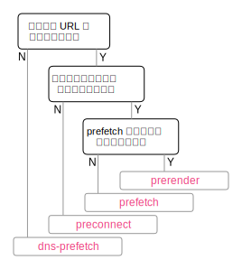

# [performance][resouce-hints] Resource Hints API でリソースの投機的取得

## Intro

Resource Hints とは現在提案されている以下のドラフトであり、ブラウザに「次に必要になるリソースを教える」ことで、投機的な取得を行う API 郡である。

[https://w3c.github.io/resource-hints/](https://w3c.github.io/resource-hints/)

主に以下がある。

- dns-prefetch
- preconnect
- prefetch
- prerender

今回は本サイトでこれを適用した話。


## 投機的なリソース取得

例えば、ログインページの次には、そのサービスのメインページに遷移する頻度が高い。

そして、メインページでは、以下のような追加のリソースが必要になる。

- 追加の JS
- 追加の CSS
- 追加の Image
- 追加の API アクセス

それぞれを DNS 解決 -> TCP 接続 -> リソースのフェッチ、と繰り返していくと、イニシャル表示は必然的に時間がかかる。

ところが、この遷移には以下の特徴がある。

- ログインページの滞在時間は長い
- 同一サービス内なので、その次のメインページで必要なリソースは予測可能性が高い

であれば、ログインページでユーザが手こずっている間に必要なものを裏で取得しておければ、ログイン後の表示に必要なリソース収集は終わっているので表示が早くなる。

投機的な取得の代表シナリオはこんな感じになる。


## Resource Hints

Resource Hints はそうしたリソースの取得のヒントをブラウザに伝える API 郡であり、基本的には前のページ(上記ならログインページ)の中で、次のページ(上記ならメインページ)で使うリソースのヒントを HTML の Link タグで記述する。

現在は四種類ある

```html
<link rel="dns-prefetch" href="//example.com">
<link rel="preconnect" href="//example.com">
<link rel="preconnect" href="//cdn.example.com" crossorigin>
<link rel="prefetch" href="//example.com/next-page.html" as="html" crossorigin="use-credentials">
<link rel="prefetch" href="/library.js" as="script">
<link rel="prerender" href="//example.com/next-page.html">
```

### dns-prefetch

DNS の問い合わせを事前に行い、キャッシュしておくことで、接続コストを下げる方法である。


```html
<link rel="dns-prefetch" href="//example.com">
```

例えば、メインページで接続する API サーバや、 CDN のエッジへの名前解決を行うなどが予想されるだろう。

特に以下のような場合に使うことができるだろう。


- 既に接続先ドメインがわかっている
- 接続する具体的な URI が、この時点では定まらない


### preconnect

DNS の解決に加えて TCP の接続まで確立しておくことで、リクエストをすぐにでも発行できるようにする方法である。

仕様では、クロスオリジンも張ることができる。

```html
<link rel="preconnect" href="//example.com">
<link rel="preconnect" href="//cdn.example.com" crossorigin>
```

これは、例えば API エンドポイントは決まっており、そこに対して連続するリクエストが発生することが分かっているような場合が予想される。

- 既に接続先ドメインがわかっている
- URI は分かっているが、レスポンスが動的なため後述する prefetch はできない


### prefetch

もはや取得するリソースが分かっており、それが投機的に取得しても内容が変わらないもの、要するに静的リソースである場合に、事前に取得してブラウザにキャッシュする方法である。


```html
<link rel="prefetch" href="/library.js" as="script">
<link rel="prefetch" href="//example.com/next-page.html" as="html" crossorigin="use-credentials">
```

- 既に URI が分かっている
- 静的リソース、もしくは投機的に取得しても内容に問題の無いエンドポイント


### prerender

prefetch 可能なリソースのみからなるページならば、ページ全体を事前に取得することが可能な筈である。

そこで、そのページ全体を取得し、バックグラウンドに起こしたタブの中で、描画まで行ってしまうという方法である。

描画が完了しているため、実際の遷移が発生したら、そのタブを切り替えるだけでよくなる。理論上は、最速となるだろう。


- prefetch 可能なリソースのみからなるページ


## 選択フロー

どの API を選ぶフローは、接続するドメインが分かっている前提であれば、以下のようになるだろう。


