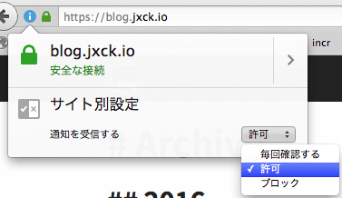

# [service worker][push] Service Worker の Push Notification を Opt-In にすべき理由と実装パターン

## Intro

Serivce Worker での Push Notification を提供するサイトも増えてきた。

しかし、実装方法によってはサイトを開いたら、無機質なダイアログが突然開きパーミッションを求められる。


権限の設定はコンテンツではなくブラウザの領域のため、コンテンツ側がこのダイアログのメッセージやデザインをカスタマイズできるものではない。

従って、ユーザは初めて訪れた知らないサイトで、その許可を利用してサービスが何をどう Push してくるのかすら説明が無いまま、「通知を許可しますか？」と問われる訳である。

ユーザの体験として良いものではない。

ユーザが反射的にブロックを選択してもしょうがないだろう。


## ブロックされることでドメインが失う機会

ここでユーザがブロックを選択するということは、サイトにとって致命的な機会損失にすらなり得る。

その **ドメイン** から、そのブラウザに対して、今後一切 Push を送ることができなくなるからだ。

一度ブロックされた場合、 JS から再度許可を求めることはできなくなる。(それができてはブロックの意味が無い)

ブロックを解除する唯一の方法は、ユーザによる設定変更だ。
ところで、その設定方法はご存知だろうか？




サービスとしてはここを変更してもらう以外に方法は無い。

facebook は以下のようなアイコンを出している。


サービスができるのはそれくらいなのである。

この設定から通知を再度許可する設定は、一般ユーザにとって簡単なことだろうか？筆者はあまりそうは思えない。

それらを踏まえて、 Push Notification の実装のあり方と、本サイトへの適用について記す。


## Push Notification の問題点

Push Notification を愚直に実装した場合、以下のようなコードが考えられる。


```js
navigator.serviceWorker.register('worker.js').then((registration) => {
  return navigator.serviceWorker.ready;
}).then((registration) => {
  return registration.pushManager.subscribe({ userVisibleOnly: true });
}).then((subscription) => {
  console.log(subscription);
});
```

ページを開いた時に Service Worker を登録し、そのまま `pushManager.subscribe()` を呼ぶことで、許可が無い場合に許可を求める。

これではユーザに対して突然許可を求めるダイアログが表示されることになる。

良くわからないダイアログが出たら、ブロックするユーザも多いだろう。


## ドメインレベルでのブロック

ブロックはドメインレベルで適用される。

つまり、そのユーザには、そのドメインから一切の通知を送ることができなくなる。

もし通知を前提としている、もしくは通知への依存が強いタイプのサービスであれば、要するにドメインが死ぬ。


```js
switch (Notification.permission) {
  case "granted":
    // granted
    break;
  case "denied":
    // denied
    break;
  case "default":
    // default
    break;
  default:
    break;
}
```


## ブロックを解除する難易度が高い

ブロックはユーザの操作によって解除することが可能だ。

具体的には以下のように行う。


TODO: すくしょ Chrome/Firefox


facebook などは、以下のようなアイコンでこれをお願いしている。


これは一般ユーザにとっては敷居が高い


## 通知への Opt-In

まず、通知はユーザが明示的に Opt-In できるようにしておくべきだろう。
Permission の要求を突然表示するのではなく、その前に通知を許可することで何がおこるのかをモーダルなどで説明し、そこでの了承が得られたら、ダイアログが出ることを事前に知らせるとより良いかもしれない。


## 通知からの Opt-Out

Opt-Out も簡単に出来るようにしておいた方がいいだろう。
この Opt-Out で、通知を送信しないようにサーバに通知する。
ユーザが Permission をメイン単位 deny にすることでの通知を拒否する操作を未然に防ぐことができる。


## サイト内 Notification の代用

ページを開いているユーザに対してなら、 Push の Notification をわざわざ出す必要も無い。
ページの内部の UI を工夫することで通知を表現することは十分可能。


## 通知内容の厳選

ユーザにとってウザいのはどうでもいい通知が頻繁に来ることだ。
どう取り繕ってもここが出来ていなければ、実装での救いようは無い。


## ブロック解除への導線

丁寧に誘導しても、思わずキャンセルしてしまうユーザは少なからずいるだろう。
そのユーザももしかしたら、再度 Opt-In を望んでいるかもしれない。

これはもう、丁寧に説明を書いてユーザに実施してもらうしか無い。
一応テンプレになりそうなものを作ってみた。


## 本サイトへの適用

本サイトでも Web Push による、ブログエントリの更新通知を実装している。
今までは、ここまでに解説した良く無い実装だったので、 Opt-In 形式に修正した。

ヘッダ部にある Push のアイコンをクリックすることで Opt-In/Out を切り替えられる。
Opt-In している時は、アイコンを黄色くしている。
