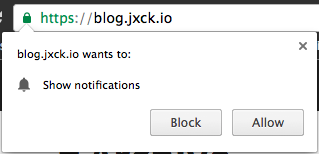
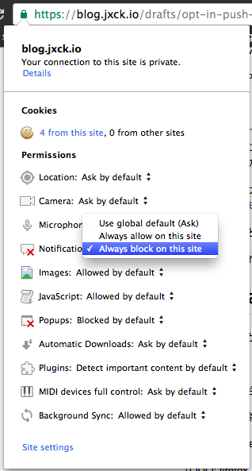

# [service worker][push] Service Worker の Push Notification を Opt-In にすべき理由と実装パターン

## Intro

Serivce Worker での Push Notification を提供するサイトも増えてきた。

しかし、実装方法によってはサイトを開いたら、無機質なダイアログが突然開きパーミッションを求められる。



ユーザの体験として良いものではないし、うんざりしている人も多いだろう。

この問題について、 UX の考慮を怠ると **サービスを提供しているドメインで後々後悔する可能性** があるという点について言及しておく。


## Push then Notification

まず、はっきりさせておくべきは、 Web Push API と Notification API は別ものであるということだ。

Web Push API は、ブラウザに対してサーバから Push を送り、それを Service Worker でイベントとして受け取る API の部分について言っている。

Notification API は、 PC ブラウザの右上などに出るあの通知を出す API だ。 Push しなくても Notification は出せる。

Push をフックして Notification を出す組み合わせはユースケースの 1 つでしかない。


## Push の制限

Web Push API は、基本的には Push するためのプロトコルの定義であり、何を送るかのペイロードについては中立であるのが望ましい。

しかし、こうした試みがまだ発展途上であるため、いきなり自由にするのではなく実装上制限を設けて展開されている。

具体的に、最初は User Visible な Push しか許可されていない、つまり Push のあと Notification しない実装は許可されていないということだ。

もしこの制限が外れれば、例えばサーバ側でコンテンツが更新されたことをブラウザに Push し、 Service Worker に Cache の更新をユーザが知らない間に行わせることも可能になるかもしれない。


## Notification の制限

Notification は、実装によってはブラウザを経由して OS の UI を起動する API になっている。

このため、 Notification には権限があり、ユーザが許可をしていないと通知を表示することができない。

権限の設定はコンテンツ(ページ)ではなくブラウザの責務であるため、 Notification をしたいコンテンツは、最初に許可を求め、それをブラウザが保存して初めて Notification があげられるのだ。

Notification の領域も、ブラウザの責務であるため、コンテンツ側からガリガリと CSS を当てられるものではない。ブラウザが許可したもの、現状は限られたテキストと画像の表示のみに止まっている。


## Permission の UX

多くの人がうんざりしているのは、 Push があること自体ではなく、 Notification が出ることだと思われる。

コンテンツが Notification を使おうと試みると、最初に出てくる許可の UI は以下のようなものだ。

TODO


Push Notification のパターンを片手間に実装すると、いきなり Notification API を叩き、結果ページを表示したらいきなりこれが出る。

従って、ユーザは初めて訪れた知らないサイトで、その許可を利用してサービスが何をどう Push してくるのかすら説明が無いまま、「通知を許可しますか?」と問われる訳である。

筆者の体感では、多くの人はこれをブロックしているのではないかと考えている。


## Permission の最有効化

ブロックされるとどうなるか。もちろんコンテンツ側の JS などからこの設定を変更することはできない、それが出来るなら許可を求める意味がないからだ。

ではどうするかというと、ユーザがブラウザの操作をし、明示的に許可を与える以外にブロックを解除する方法はない。

現状、主要なブラウザはこの UI を URL バーの部分に置いている。


TODO: Permission panel



見てわかるように、 Notification 以外の許可も、ここで一括して管理されている。

ここに設定があることを知っていて、さらにこの一覧を見て何をどう操作すれば良いかがわかるには、相当のリテラシーが必要だろう。

例えば PWA 化の波で、 Notification を使うようになった FB は、ブロックしたユーザに以下のような矢印を出す。


国内企業がこうしたサイトを作るようになれば、以下のような設定ページが作られる日も近いだろう。


TODO: 図解ページ


サービスができるのはそれくらいなのである。

それでも、この設定から通知を再度許可する設定は、一般ユーザにとって簡単なことだろうか?筆者はあまりそうは思えない。
これらを踏まえて筆者が感じるのは、「一度ブロックされたら、ほとんどは二度と解除されないだろう」ということだ。


## ブロックはドメイン単位

ここで注意したいのは、この許可は **ページ** ではなく **ドメイン** の単位だということだ。

もし Notification がブロックされれば、そのドメインで Notification を出すことはもうできないということだ。

他の権限についても同様で、もしその権限に依存したサービスを展開したいのであれば、多くのユーザからブロックを食らったら、そのドメインは使い物にならなくなる。

つまり、その許可が重要であればあるほど、許可を求める際は、やりすぎなくらい慎重に UX を設計した方が良いだろう。


## 許可の UX

ここまでのことを踏まえて、 Push Notification のようにユーザの許可が必要となる機能を提供する際に、考慮すべきと思う機能についてあげておく。


### Opt-In ベースの動線

なによりもまず、ユーザが明示的に Opt-In できるようにしておくべきだろう。
ページを開いたらいきなりダイアログが出る実装は、ブロックしてくださいと言っているようなものだ。

Permission の要求を突然表示するのではなく、その前に通知を許可することで何がおこるのか(何がどのような頻度で通知されるのか)、などを説明するモーダルなどを挟むのが良い。
モーダルを挟めば、もしユーザがそれを好まなかった場合、閉じられるのがモーダルだけで済む。ブロックされてない分、後にまた許可を求められる。

モーダルで了承が得られたら、次にダイアログが出ることを事前に知らせるとより良いかもしれない。
ここで、念押しでブロックするくらいならキャンセルして欲しい旨を伝えるサイトもあった。


## 通知からの Opt-Out

Opt-Out も簡単に出来るようにしておいた方がいいだろう。
万が一、ユーザが Permission をメイン単位 deny にすることでの通知を拒否する操作を未然に防ぐことができる。
Notification の許可は得たまま、サーバ/クライアントの実装の部分で、 Notification を出さないようにすれば良い。

例えば、サーバ側で Push する相手を client id などで識別していると思うので、ここから該当するユーザを除外する。
もしくは、実装によっては Push をブラウザに送るところまではするが、フラグによって onpush 内で showNotification しないという実装もできるだろう。
ここの実装をミスって Opt-Out したのに表示されてしまうと非常に問題なので注意が必要。

これなら、再度 Opt-In する際は許可を求めるダイアログがいらない。
Opt-Out の敷居は低いほど良いのではないかと思われる。


## Notification 種類/頻度設定

Notification は、 Notification のダイアログからブロックスることができる。
つまり、あまりに高頻度で出し過ぎたり、イラっとするものが出ると、思わずブロックされてしまう可能性がある。

Opt-Out と組み合わせて、頻度や内容の設定がある程度出来る方が良いだろう。
Chat の全ての発言を出すのではなく、ある程度の数をまとめるといった実装も良いだろう。


## サイト内 Notification の代用

そもそも Push Notification が本当に有効なのは、 PC ではタブが開いてない時、 Android なら Chrome すら開いてない時でも、通知からコンテンツに誘導できる点だ。
ページを開いているユーザに対してなら、 Push Notification をわざわざ使う必要はない。
Push Notification は出せば出すほどブロックの機会が増えるだけだ。
WebSocket + 画面内の表示領域と Favicon の変更くらいでも十分伝わるだろう。
こうした大体は、ユーザにとっても負荷が低いと思われる。


## ブロック解除への導線

丁寧に誘導しても、思わずキャンセルしてしまうユーザは少なからずいるだろう。
そのユーザももしかしたら、再度 Opt-In を望んでいるかもしれない。

これはもう、丁寧に説明を書いてユーザに実施してもらうしか無い。
一応テンプレになりそうなものを作ってみた。


## 本サイトへの適用

本サイトでも Web Push による、ブログエントリの更新通知を実装している。
今までは、ここまでに解説した良く無い実装だったので、 Opt-In 形式に修正した。

ヘッダ部にある Push のアイコンをクリックすることで Opt-In/Out を切り替えられる。
Opt-In している時は、アイコンを黄色くしている。


## Push Notification の問題点

Push Notification を愚直に実装した場合、以下のようなコードが考えられる。


```js
navigator.serviceWorker.register('worker.js').then((registration) => {
  return navigator.serviceWorker.ready;
}).then((registration) => {
  return registration.pushManager.subscribe({ userVisibleOnly: true });
}).then((subscription) => {
  console.log(subscription);
});
```

ページを開いた時に Service Worker を登録し、そのまま `pushManager.subscribe()` を呼ぶことで、許可が無い場合に許可を求める。

これではユーザに対して突然許可を求めるダイアログが表示されることになる。

良くわからないダイアログが出たら、ブロックするユーザも多いだろう。


## ドメインレベルでのブロック

ブロックはドメインレベルで適用される。

つまり、そのユーザには、そのドメインから一切の通知を送ることができなくなる。

もし通知を前提としている、もしくは通知への依存が強いタイプのサービスであれば、要するにドメインが死ぬ。


```js
switch (Notification.permission) {
  case "granted":
    // granted
    break;
  case "denied":
    // denied
    break;
  case "default":
    // default
    break;
  default:
    break;
}
```


## ブロックを解除する難易度が高い

ブロックはユーザの操作によって解除することが可能だ。

具体的には以下のように行う。


TODO: すくしょ Chrome/Firefox


facebook などは、以下のようなアイコンでこれをお願いしている。


これは一般ユーザにとっては敷居が高い


