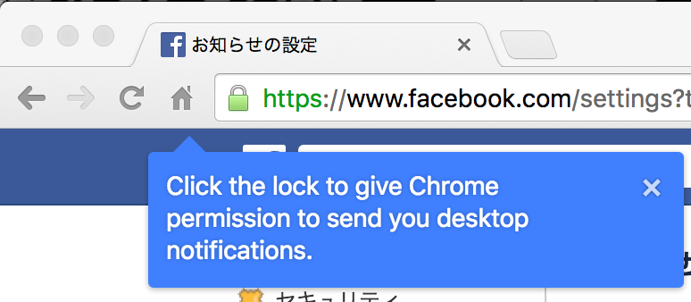

# [service worker][push] Service Worker の Push Notification を Opt-In にすべき理由と実装パターン

## Intro

Serivce Worker での Push Notification を提供するサイトも増えてきた。

しかし、実装方法によってはサイトを開いたら、無機質なダイアログが突然開きパーミッションを求められる。

TODO: 図

これはブラウザ側のダイアログであり、コンテンツ側がメッセージやデザインをカスタマイズできるものではない。

従って、ユーザは初めて訪れた知らないサイトで、その許可を利用してサービスが何をどう Push してくるのかすら補足説明が無いまま、「通知を許可しますか？」と問われる訳である。

ユーザの体験として良いものではない。

ユーザが反射的にブロックを選択してもしょうがないだろう。

## ブロックされることでドメインが失う機会

ここでユーザがブロックを選択するということは、サイトにとって致命的な機会損失にすらなり得る。

その **ドメイン** から、そのブラウザに対して、今後一切 Push を送ることが一切できなくなるからだ。

一度ブロックされた場合、 JS から許可を求めることはできなくなる。(それができてはブロックの意味が無い。)

ブロックを解除する唯一の方法は、ユーザによる設定変更だ。
ところで、その設定方法はご存知だろうか？

TODO: chrome 

TODO: firefox 

サービスとしてはここを変更してもらう以外に方法は無い。

facebook は以下のようなアイコンを出している。

この設定から通知を再度許可する設定は、一般ユーザにとって簡単なことだろうか？筆者はあまりそうは思えない。

そもそもこの permission 管理の画面
、あまり現実的ではないと思われる。

それらを踏まえて、 Push Notification の実装のあり方と、本サイトへの適用について記す。


## Push Notification の問題点

Push Notification を愚直に実装した場合、以下のようなコードが考えられる。


TODO


しかし、これではユーザに対して突然許可を求めるダイアログが表示されることになる。

良くわからないダイアログが出たら、ブロックするユーザも多いだろう。


## ドメインレベルでのブロック

ブロックはドメインレベルで適用される。

つまり、そのユーザには、そのドメインから一切の通知を送ることができなくなる。

もし通知を前提としている、もしくは通知への依存が強いタイプのサービスであれば、要するにドメインが死ぬ。


```js
switch (Notification.permission) {
  case "granted":
    // granted
    break;
  case "denied":
    // denied
    break;
  case "default":
    // default
    break;
  default:
    break;
}
```


## ブロックを解除する難易度が高い

ブロックはユーザの操作によって解除することが可能だ。

具体的には以下のように行う。


TODO: すくしょ Chrome/Firefox


facebook などは、以下のようなアイコンでこれをお願いしている。





これは一般ユーザにとっては敷居が高い


## 通知へのオプトイン


## サイト内 Notification の代用

ページを開いているのなら、 Push の Notification をわざわざ出す必要も無い。

ページの内部の UI を工夫することで通知を表現することは十分可能。


## 通知内容の厳選

## ブロック解除への導線

## 本サイトへの適用

