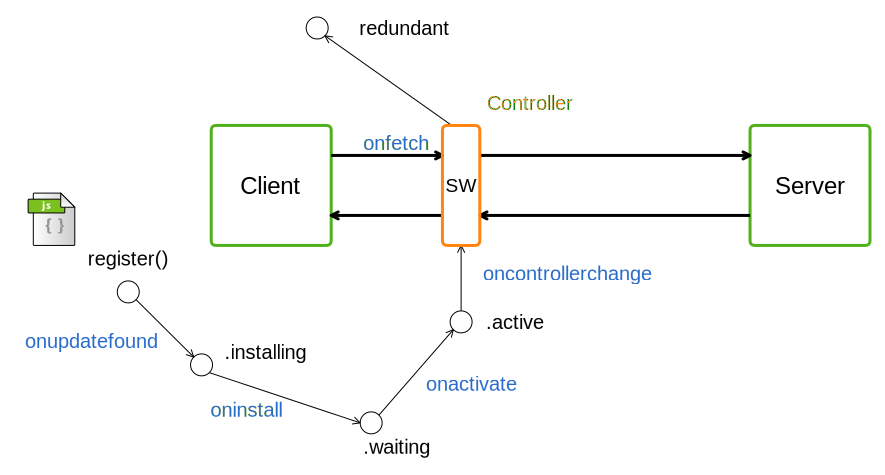

# [service worker][tutorial] 中級者向け Service Worker Tutorial

## Intro

Service Worker の初心者向けのチュートリアルや、使ってみた系のエントリも増えてきました。
しかし、 Service Worker は通常のブラウザ用 JS の開発と少し経路が違い、慣れるまで開発やデバッグもなかなか難しいと思います。

そこで特に難しい部分、そして分かっていないと実際にデプロイした際に難しいと思う部分について、実際に動きを確認しながら解説したいと思います。

なお、 Service Worker の基本的な概念などについては、他のチュートリアルなどを見て理解している前提で進めます。

思いつきで撮ったので色々ミスも有ります、また Chrome Dev Tools の UI はどうせ変わるのでそのつもりで見てください。

TODO になっている動画は、そのうち撮って追加します。

**あと、全部撮り終わってからキーボードを打つ音がうるさいのに気づいたので、 GW 中にでも追加分と合わせて取りなおそうかと思います。。**


## claim

controller とは何か、いつ controller になるか、 `clamim()` で何が起こるのかなどについて。

<iframe width="560" height="315" src="https://www.youtube.com/embed/m6qBg4M3RTA" frameborder="0" allowfullscreen></iframe>


```html
<!DOCTYPE html>
<meta charset=utf-8>
<title>Service Worker</title>

<h1>Service Worker</h1>

<a href=test>test</a>

<input id=test type=button value=test>

<script src=main.js></script>
```

```js
console.log('master');

document.getElementById('button').addEventListener('click', () => {
  fetch('/test');
});

navigator.serviceWorker.register('worker.js').then((registration) => {
  console.log(registration);
});
```

```js
console.info(` worker`);

self.addEventListener('activate', (e) => {
  console.info('activate', e);
  e.waitUntil(self.clients.claim());
});

self.addEventListener('fetch', (e) => {
  let path = new URL(e.request.url).pathname;
  console.log(path);
  if (path === '/test') {
    e.respondWith(new Response('test'));
  }
  return;
});
```

## controllerchange

register が終わった後、「新しく登録された controller が使えるようになったら」または「すでに登録されている controller が使えるようになったら」という状態をとる方法と `controllerchange` イベント。

<iframe width="560" height="315" src="https://www.youtube.com/embed/XoI0FPDV8Xo" frameborder="0" allowfullscreen></iframe>


```js
console.log('master');

let controllerChange = new Promise((resolve, reject) => {
  navigator.serviceWorker.addEventListener('controllerchange', () => {
    resolve(navigator.serviceWorker.controller);
  });
});

navigator.serviceWorker.register('worker.js').then((registration) => {
  return navigator.serviceWorker.ready;
}).then(() => {
  if (navigator.serviceWorker.controller) {
    return navigator.serviceWorker.controller;
  }
  return controllerChange;
}).then((controller) => {
  console.log(controller);
  fetch('/test');
});

```

```js
console.info(` worker`);

self.addEventListener('activate', (e) => {
  console.info('activate', e);
  e.waitUntil(self.clients.claim());
});

self.addEventListener('fetch', (e) => {
  let path = new URL(e.request.url).pathname;
  console.log(path);
  if (path === '/test') {
    e.respondWith(new Response('test'));
  }
  return;
});
```


## updatefound

Service Worker が更新される際の動きと、 `skipWaiting()` が何をスキップするのか？
`install`, `activate` イベントの用途。

<iframe width="560" height="315" src="https://www.youtube.com/embed/AMbQ7d9rjao" frameborder="0" allowfullscreen></iframe>

```js
console.log('master');

navigator.serviceWorker.register('worker.js').then((registration) => {
  registration.addEventListener('updatefound', (e) => {
    console.info(' update', e);
  });
  return navigator.serviceWorker.ready;
});
```

```js
console.info(` worker`);

const ver = 2;

self.addEventListener('install', (e) => {
  console.info(` install${ver}`, e);
  e.waitUntil(skipWaiting());
});

self.addEventListener('activate', (e) => {
  console.info(` activate${ver}`, e);
  e.waitUntil(self.clients.claim());
});

self.addEventListener('fetch', (e) => {
  let path = new URL(e.request.url).pathname;
  console.log(path);
  if (path === '/test') {
    e.respondWith(new Response('test'));
  }
  return;
});
```

## update()

`update()` とキャッシュ周りの挙動

TODO (GW予定/未定)


## scope

scope の影響範囲と、複数のワーカが有った場合の挙動

TODO (GW予定/未定)


## sync

background sync の発火タイミング

TODO (GW予定/未定)


## push

push に必要な情報とその取り方、投げ方。

TODO (GW予定/未定)


## 図

映像中で使用した図です


